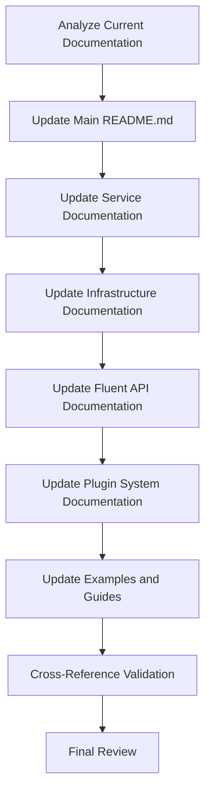

# ClickUp .NET SDK Documentation Update Requirements

## 1. Product Overview

Comprehensive documentation update for the ClickUp .NET SDK to reflect recent architectural improvements and new features. The documentation needs to showcase the enhanced architecture, improved developer experience, and new capabilities that have been implemented.

## 2. Core Features

### 2.1 Documentation Scope

The documentation update covers four major architectural improvements:

* Service decomposition following Single Responsibility Principle

* Infrastructure abstraction layer implementation

* Enhanced fluent API capabilities

* Extensible plugin system with sample implementations

### 2.2 Feature Module

Our documentation update requirements consist of the following main areas:

1. **Main README.md**: Primary project documentation with architecture overview, quick start guide, and feature highlights.
2. **Service Architecture Documentation**: Detailed explanation of decomposed services and interfaces.
3. **Infrastructure Layer Documentation**: Coverage of abstraction implementations for file system, date/time, HTTP client factory, and configuration.
4. **Fluent API Documentation**: Enhanced API features including URL builders, templates, validation pipelines, and configuration builders.
5. **Plugin System Documentation**: Extensible plugin architecture with sample implementations.
6. **Developer Guide Updates**: Integration examples and best practices.
7. **API Reference Updates**: Updated method signatures and interface documentation.

### 2.3 Page Details

| Document Name                          | Module Name           | Feature Description                                                                                                      |
| -------------------------------------- | --------------------- | ------------------------------------------------------------------------------------------------------------------------ |
| Main README.md                         | Project Overview      | Update architecture section, add new features overview, enhance quick start guide with new capabilities                  |
| Main README.md                         | Service Architecture  | Document decomposed task and view services, explain Single Responsibility Principle implementation                       |
| Main README.md                         | Infrastructure Layer  | Describe abstraction layer with file system, date/time providers, HTTP client factory, and configuration implementations |
| Main README.md                         | Fluent API Features   | Showcase enhanced fluent API with URL builders, templates, validation pipelines, and configuration builders              |
| Main README.md                         | Plugin System         | Introduce extensible plugin system with sample plugins for logging, rate limiting, and caching                           |
| docs/doc-proposed/services.md          | Service Documentation | Update service implementation status, add decomposed service interfaces, explain architectural benefits                  |
| docs/doc-proposed/sdk-usage.md         | Usage Examples        | Add examples using new fluent API features, plugin system integration, and infrastructure abstractions                   |
| docs/docfx/articles/getting-started.md | Getting Started Guide | Update setup instructions to include new features, add plugin configuration examples                                     |
| docs/docfx/articles/migration-guide.md | Migration Guide       | Add migration instructions for new service interfaces and fluent API enhancements                                        |
| examples/\*/README.md                  | Example Documentation | Update example project documentation to reflect new architectural patterns                                               |

## 3. Core Process

### Documentation Update Flow

1. **Analysis Phase**: Review existing documentation structure and identify areas requiring updates
2. **Content Creation**: Develop new content sections covering the four major architectural improvements
3. **Integration Phase**: Seamlessly integrate new content into existing documentation structure
4. **Example Updates**: Update code examples and usage patterns throughout documentation
5. **Cross-Reference Updates**: Ensure all internal links and references are updated
6. **Review and Validation**: Verify technical accuracy and completeness of updates

## 4. User Interface Design

### 4.1 Design Style

* **Documentation Format**: Markdown with consistent formatting and structure

* **Code Examples**: Syntax-highlighted C# code blocks with clear comments

* **Diagrams**: Mermaid diagrams for architectural overviews and process flows

* **Navigation**: Clear table of contents and cross-references

* **Visual Elements**: Badges, callout boxes, and structured tables for better readability

### 4.2 Page Design Overview

| Document Section      | Content Type            | Design Elements                                              |
| --------------------- | ----------------------- | ------------------------------------------------------------ |
| Architecture Overview | Narrative + Diagrams    | Mermaid flowcharts, bullet points, code snippets             |
| Service Decomposition | Technical Documentation | Interface definitions, UML-style diagrams, comparison tables |
| Infrastructure Layer  | Implementation Guide    | Code examples, configuration snippets, usage                 |

